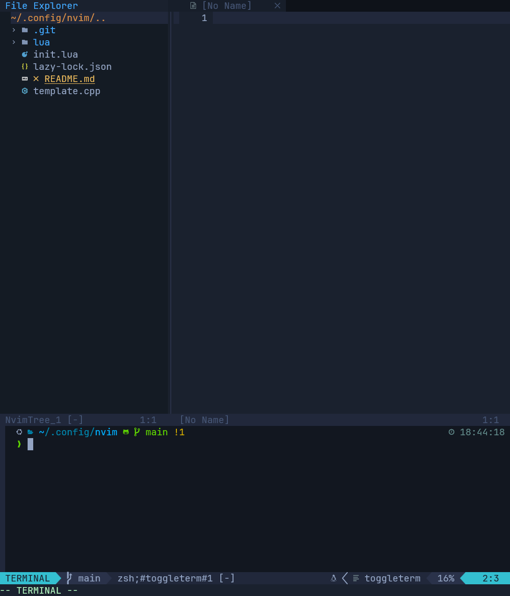

# Nvim

My personal Neovim configuration using lazy.nvim as the plugin manager. This setup provides a modern IDE-like experience with carefully selected plugins for development.

## Preview


## ✨ Features

- 🚀 Fast startup powered by lazy.nvim
- 🎨 Beautiful OneDark theme
- 📁 File explorer with nvim-tree
- 🔍 Powerful fuzzy finding with Telescope
- 🌳 Syntax highlighting with Treesitter
- 💡 LSP support with autocompletion
- 🤖 GitHub Copilot integration
- 🔥 Git integration with gitsigns
- 📑 Buffer management with bufferline
- 🔧 Terminal integration with toggleterm

## 🔌 Plugin List

### Core Plugins
- **lazy.nvim** - Modern plugin manager
- **onedark** - Theme and colorscheme

### UI Enhancement
- **lualine** - Statusline
- **nvim-tree** - File explorer
- **bufferline** - Buffer/Tab management
- **indent-blankline** - Indent guides
- **nvim-ufo** - Ultra fold with modern UI

### Development
- **nvim-treesitter** - Syntax highlighting
- **nvim-lspconfig** - LSP configuration
- **nvim-cmp** - Completion engine
- **copilot.lua** - GitHub Copilot integration
- **Comment.nvim** - Code commenting
- **nvim-autopairs** - Auto pair brackets
- **gitsigns.nvim** - Git decorations
- **telescope.nvim** - Fuzzy finder
- **toggleterm** - Terminal integration

## 📂 Structure

```
.
├── init.lua
├── lua
│   ├── core
│   │   ├── options.lua   # Neovim options
│   │   └── keymaps.lua   # Key mappings
│   └── plugins
│       ├── lazy-nvim.lua # Plugin manager setup
│       ├── onedark.lua   # Theme configuration
│       ├── lualine.lua   # Status line
│       ├── nvim-tree.lua # File explorer
│       └── ...          # Other plugin configs
```

## ⚡️ Requirements

- Neovim >= 0.8.0
- Git
- A [Nerd Font](https://www.nerdfonts.com/) for icons
- (Optional) ripgrep for Telescope file search
- (Optional) A C compiler for Treesitter

## 🚀 Installation

1. Backup your existing Neovim configuration:
```bash
mv ~/.config/nvim ~/.config/nvim.bak
```

2. Clone this repository:
```bash
git clone https://github.com/YOUR_USERNAME/nvim.git ~/.config/nvim
```

3. Start Neovim:
```bash
nvim
```
Lazy.nvim will automatically install all plugins on first launch.

## ⌨️ Key Mappings

> Note: Leader key is set to `<Space>`

### Normal Mode
#### Window Management
- `<Leader>sv` - Split window vertically
- `<Leader>sh` - Split window horizontally
- `<Leader>nh` - Clear search highlighting

#### Buffer Navigation
- `<C-L>` - Next buffer
- `<C-H>` - Previous buffer

#### File Explorer
- `<Leader>e` - Toggle NvimTree file explorer

### Insert Mode
- `jk` - Exit insert mode (alternative to `<ESC>`)

### Visual Mode
#### Line Movement
- `J` - Move selected lines down
- `K` - Move selected lines up

### Development
- `<F5>` - Compile and run C++ (output redirected from input.txt to output.txt)
- `<Leader>tp` - Load C++ template from ~/.config/nvim/template.cpp

## 📝 Custom Configuration

To add your own customizations, you can:

1. Modify existing plugin configurations in `lua/plugins/`
2. Add new plugin configurations following the lazy.nvim spec
3. Adjust core settings in `lua/core/options.lua`
4. Customize keymaps in `lua/core/keymaps.lua`

## 🤝 Contributing

Feel free to submit issues and enhancement requests!

